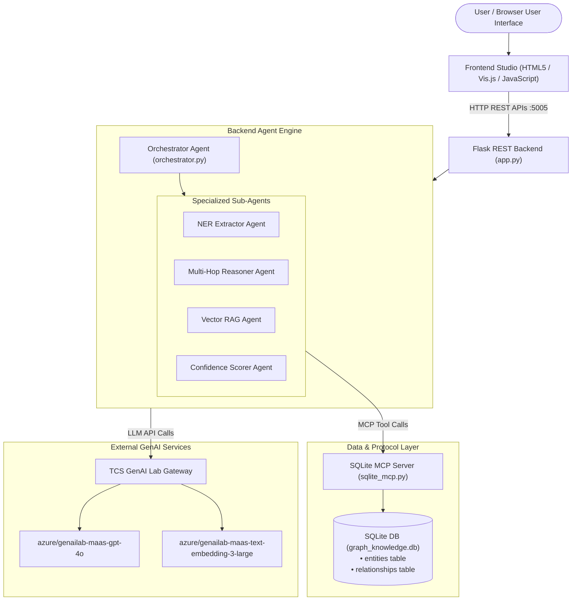
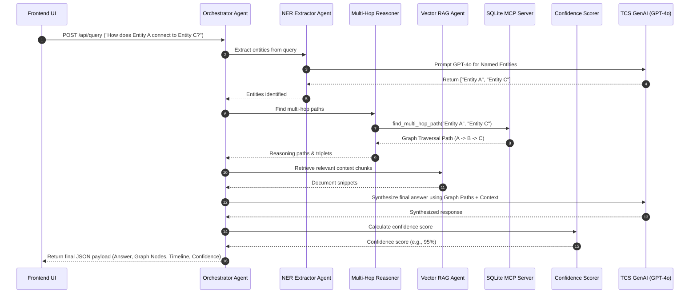

# GraphRAG Studio — Comprehensive Application Documentation

Welcome to the documentation for **GraphRAG Studio (GRAPHRAG_QNA)**, an enterprise AI solution developed for multi-hop reasoning, knowledge graph traversal, and question answering.

---

## 1. Executive Overview

> [!NOTE]
> **What is GraphRAG Studio (`GRAPHRAG_QNA`)?**  
> GraphRAG Studio is a **Multi-Agent Question & Answering (Q&A) Platform** that overcomes the limitations of standard LLM RAG systems (such as hallucinations and lack of multi-step relationship reasoning). It combines **Knowledge Graphs**, **Multi-Agent Orchestration**, **Model Context Protocol (MCP)**, local **SQLite Storage**, and **TCS GenAI (GPT-4o)** to deliver precise, explainable answers with multi-hop path transparency and confidence scoring.

### Key Value Propositions
* **Multi-Hop Reasoning:** Discovers complex, non-obvious relationships across multiple entities (e.g., *Entity A → Entity B → Entity C*).
* **Model Context Protocol (MCP):** Exposes standard database traversal tools allowing AI agents to query local knowledge deterministically.
* **Multi-Agent Architecture:** Spawns 5 specialized sub-agents working together (NER, Graph Traversal, Vector Search, Answer Synthesis, Confidence Scoring).
* **Interactive Graph Visualization:** Visualizes the entire knowledge network in real-time using an interactive Vis.js graph UI.

---

## 2. System Architecture



---

## 3. Technology Stack

| Layer | Technology / Library | Purpose |
| :--- | :--- | :--- |
| **Frontend** | HTML5, CSS3, Vanilla JavaScript, Vis.js Network, FontAwesome | User interface, Vis.js Knowledge Graph renderer, agent execution timeline, Q&A console, and pitch timer. |
| **Backend Framework** | Python 3, Flask, Flask-CORS | REST API server listening on `http://localhost:5005`. |
| **Database** | SQLite3 (`graph_knowledge.db`) | Local storage for `entities` and `relationships` tables. |
| **AI Protocol** | Model Context Protocol (MCP 1.0) | Wraps SQLite queries into standard tools (`query_entity_neighborhood`, `find_multi_hop_path`, `execute_graph_search`). |
| **LLM & Embeddings** | TCS GenAI Lab Gateway (`azure/genailab-maas-gpt-4o`) | Entity extraction, reasoning path synthesis, and embeddings generation. |

---

## 4. Multi-Agent Orchestration Pipeline

The application features 5 specialized AI agents working together in a coordinated pipeline:



### Detailed Agent Roles:

1. **Orchestrator Agent (`orchestrator.py`):** The master controller that receives the user query, manages execution flow across sub-agents, aggregates results, and builds the final JSON output.
2. **NER Extractor Agent (`ner_extractor.py`):** Analyzes natural language input (queries or raw documents) to extract key entities and relationship triplets (`source`, `relation`, `target`).
3. **Multi-Hop Reasoner Agent (`multi_hop_reasoner.py`):** Executes graph traversal algorithms via MCP tools to discover 2-hop and 3-hop connection paths between entities.
4. **Vector RAG Agent (`vector_rag.py`):** Performs semantic text snippet search to provide textual context alongside the graph relationships.
5. **Confidence Scorer Agent (`confidence_scorer.py`):** Evaluates path length, entity reliability scores, relationship weights, and source doc verification to assign an objective percentage score (e.g. 95%).

---

## 5. API Endpoints Reference

The backend Flask server (`Backend_graph/app.py`) exposes the following endpoints:

| Endpoint | Method | Description |
| :--- | :--- | :--- |
| `/` | `GET` | Server status and list of available endpoints. |
| `/api/health` | `GET` | Health check returning service status, model configuration, and MCP status. |
| `/api/query` | `POST` | Main Q&A endpoint. Triggers the full 5-agent pipeline. |
| `/api/graph/visualization` | `GET` | Fetches all nodes and edges from SQLite for the Vis.js frontend visualizer. |
| `/api/ingest` | `POST` | Ingests new unstructured text, extracts triplets via NER agent, and inserts into SQLite via MCP. |
| `/api/mcp/tools` | `GET` | Lists all MCP database tools exposed to the agent system. |

---

## 6. Directory & File Structure

```
GraphRAG_QnA/
├── README.md                      # Primary project overview & presentation script
├── DOCUMENTATION.md               # Comprehensive application documentation
├── SKILL.md                       # Hackathon resolution workflow blueprint
├── ANTIGRAVITY_PROMPT.md          # Setup instructions & prompt guidelines
├── Backend_graph/                 # Python Flask Backend
│   ├── app.py                     # Main Flask server REST endpoints
│   ├── config.py                  # API keys and TCS GenAI endpoints configuration
│   ├── database.py                # SQLite database connection helper
│   ├── init_db.py                 # Database initialization & seed data script
│   ├── graph_knowledge.db         # SQLite database file
│   ├── tcs_genai.py               # TCS GenAI Lab Gateway client wrapper
│   ├── test_verification.py       # Automated testing & verification script
│   ├── requirements.txt           # Python dependencies
│   ├── agents/                    # Multi-Agent implementations
│   │   ├── orchestrator.py        # Master Orchestrator Agent
│   │   ├── ner_extractor.py       # Named Entity Recognition Agent
│   │   ├── multi_hop_reasoner.py  # Graph Traversal Agent
│   │   ├── vector_rag.py          # Semantic Retrieval Agent
│   │   └── confidence_scorer.py   # Confidence Scorer Agent
│   └── mcp_servers/
│       └── sqlite_mcp.py          # Model Context Protocol (MCP) SQLite tool server
└── Frontend_graph/                # Frontend Web Application
    ├── index.html                 # Main Single-Page Studio HTML
    ├── app.js                     # UI logic, Vis.js graph rendering, API integration
    ├── styles.css                 # Custom CSS stylesheet
    └── package.json               # Package metadata for local serving
```

---

## 7. How to Run the Application

### Step 1: Initialize Database
```bash
cd C:\Users\GenAIKOCVISUSR15\dummy_23\GraphRAG_QnA\Backend_graph
python init_db.py
```

### Step 2: Start Backend Server
```bash
python app.py
```
*Backend will start on `http://localhost:5005`.*

### Step 3: Launch Frontend
Open `C:\Users\GenAIKOCVISUSR15\dummy_23\GraphRAG_QnA\Frontend_graph\index.html` in a browser, or run:
```bash
cd C:\Users\GenAIKOCVISUSR15\dummy_23\GraphRAG_QnA\Frontend_graph
npx http-server -p 4200
```
*Access the UI studio at `http://localhost:4200`.*

---

## 8. Summary for Non-Technical Stakeholders

> [!TIP]
> **In Simple Terms:**  
> Think of **GraphRAG Studio** as a supercharged search engine. Instead of just searching for keywords or guessing answers like standard ChatGPT, it draws a "mind map" (Knowledge Graph) of how facts, people, companies, or technologies are connected. When you ask a question, 5 specialized "digital assistants" (agents) search the mind map step-by-step, trace the exact path connecting the dots, double-check the confidence score, and explain the answer visually on your screen!
